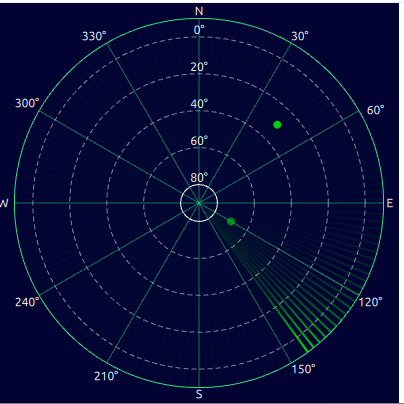

# Example Radar QML Plugin

This project is a **QML plugin for displaying radar data**, where data is provided from C++ to QML.
In this version, the focus is on the **basic architecture**, and **Realtime functionality is not implemented yet**.

---



- **RadarTargetModel**: List model for radar targets, instance-based, multiple instances can exist  
- **RadarController**: Singleton, manages data and updates all registered models  
- **SkyView.qml**: QML component that displays the radar data

**Benefits:**

- No need to use `setContextProperty` in QML  
- Multiple RadarViews can be used simultaneously  
- Controller and model are separate (modular and testable)  

---

## Installation and Usage

1. **Import the plugin in QML:**

```qml
import QtQuick
import ScopeRadarQmlPlugin

Item {

    id:root
    width: 400 //radar.implicitWidth
    height: 400 //radar.implicitWidth
    visible: true
    //title: qsTr("Hello World")
    RadarTargetModel {
        id: radarModel
    }

    SkyView{
        id:radar
    anchors.centerIn: parent
    width: parent.width
    height: parent.height
    radarModel: radarModel
    }
}
```
2. **data in cpp**
```cpp
QList<RadarTarget> list;
list.append({45, 30, 0.8});
list.append({120, 70, 0.5});

RadarController::instance()->updateTargets(list);
```
## Important Notes
- Before QML is loaded, no model exists → initial data cannot be sent until models are constructed 
- Models automatically register themselves with the Controller in their constructor
- This version is not realtime; it uses beginResetModel() for updates